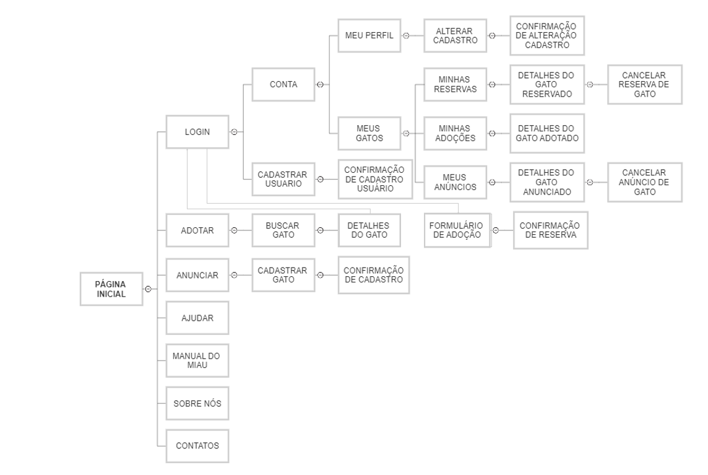

# Projeto de Interface

O site terá um design responsivo e amigável, com o objetivo de facilitar a navegação dos usuários e fomentar a adoção de animais. O projeto de interface seguirá as boas práticas de usabilidade, permitindo uma experiência de usuário agradável e intuitiva.

## Fluxo do Usuário
O fluxo do usuário foi estruturado para que as pessoas possam facilmente encontrar um gato para adotar ou anunciar e, ao mesmo tempo, entender o processo de adoção e interagir com o site.

