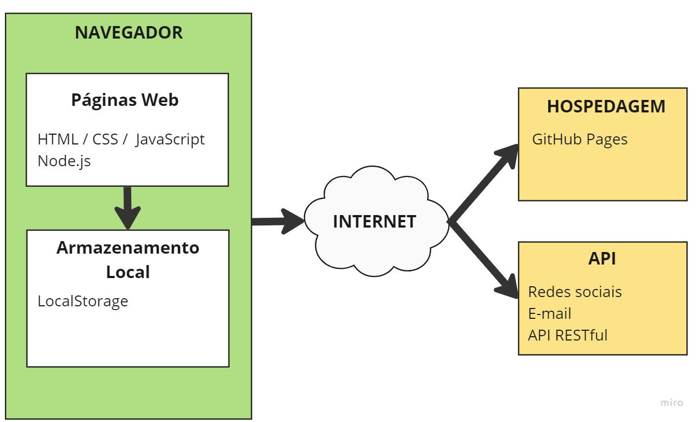

# Arquitetura da Solução

  Nesta seção são apresentados os detalhes técnicos da solução criada pela equipe, tratando dos componentes que fazem parte da solução e do ambiente de hospedagem da solução.

## Diagrama de componentes

  Diagrama que permite a modelagem física de um sistema, através da visão dos seus componentes e relacionamentos entre os mesmos.

  Os componentes que fazem parte da solução são apresentados na Figura 01.

  
  
Figura 01 - Diagrama de Solução

### A solução implementada conta com os seguintes módulos:

> 
 <strong> Client-side:</strong> HTML, CSS e JavaScript, que são as tecnologias básicas para construir a interface do site e suas funcionalidades. <break>
>
> <strong> Server-side: </strong> Para o servidor, pode-se utilizar o Node.js, que é uma plataforma JavaScript que permite a construção de servidores web escaláveis e de alto desempenho. <break>
>
> <strong> Banco de dados: </strong> Para armazenar os dados do site, pode-se utilizar o MySQL, PostgreSQL ou MongoDB, que são bancos de dados populares e acessíveis. <break>
>
> <strong> API's: </strong>
APIs de redes sociais: como a API do Facebook, Twitter e Instagram. <break>
APIs de e-mail: como o serviço de e-mails da Google (Gmail) ou Microsoft (Outlook). <break>
API RESTful: para comunicação entre front-end e back-end.

 ## Fluxo do Usuário:

   O fluxo do usuário foi estruturado para que as pessoas possam facilmente encontrar um gato para adotar ou anunciar e, ao mesmo tempo, entender o processo de adoção e interagir com o site. 

  
  
Figura 02 - Fluxo do Usuário

 
## Diagrama de Classes:

  
  
Figura 03 - Diagrama de Classes

## Tecnologias Utilizadas:
 
|Descrição| Tecnologia |
|---|---|
|Linguagens de programação|	`HTML5` para a estruturação do conteúdo   `CSS3` para a estilização e layout   `JavaScript` para a programação de interações e funcionalidades do site|
|Serviços web|`Github Pages` servidor web para hospedar o site|
|Frameworks e bibliotecas|`Bootstrap` framework CSS que fornece componentes responsivos e estilos pré-definidos|
|IDEs de desenvolvimento|`Visual Studio Code` para desenvolvimento do código|
|Ferramentas|`Git e Github (desktop e WEB)` para versionamento e documentação do projeto   `GIMP` e `Canva` para criação e edição de imagens   `Google Fonts` para as fontes utilizadas no site|

## Hospedagem:

O site será hospedado pelo GitHub Pages.

> **Links Úteis**:
>
> - [Website com GitHub Pages](https://pages.github.com/)
> - [Programação colaborativa com Repl.it](https://repl.it/)
> - [Getting Started with Heroku](https://devcenter.heroku.com/start)
> - [Publicando Seu Site No Heroku](http://pythonclub.com.br/publicando-seu-hello-world-no-heroku.html)
