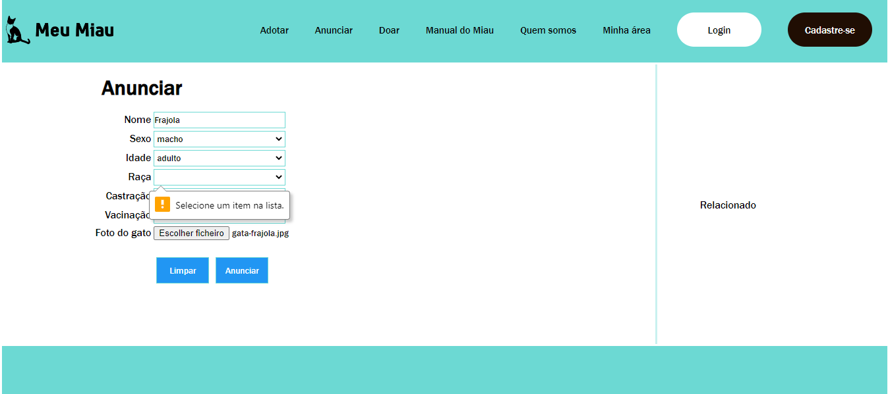
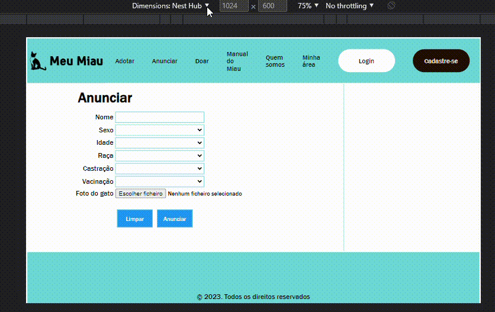
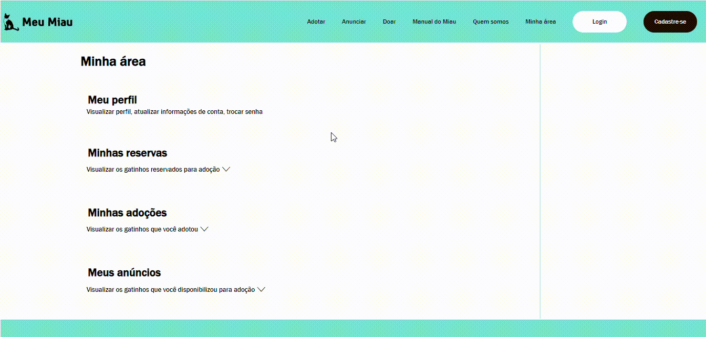
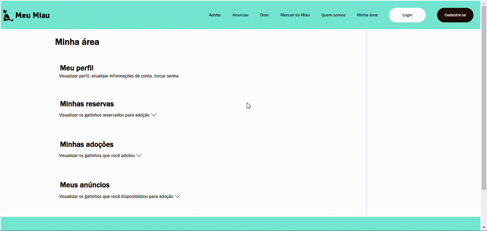

# Registro de Testes de Software

Pré-requisitos: <a href="3-Projeto de Interface.md"> Projeto de Interface</a>, <a href="8-Plano de Testes de Software.md"> Plano de Testes de Software</a>

Relatório com as evidências dos testes de software realizados no sistema pela equipe, baseado em um plano de testes pré-definido.

## Evidências dos Casos de Teste (CT)

### CT-001 - Validação de campo vazio no cadastro do gato

- Responsável pelo teste: Márcio
- Avaliação: Passou no teste

### CT-002 - Responsividade do menu principal

- Responsável pelo teste: Márcio
- Avaliação: Passou no teste

### CT-003 - Visualizar gatos anunciados na seção "Meus anúncios"

- Responsável pelo teste: Márcio
- Avaliação: Passou no teste

## Avaliação

Discorra sobre os resultados do teste. Ressaltando pontos fortes e fracos identificados na solução. Comente como o grupo pretende atacar esses pontos nas próximas iterações. Apresente as falhas detectadas e as melhorias geradas a partir dos resultados obtidos nos testes.

> **Links Úteis**:
> - [Ferramentas de Test para Java Script](https://geekflare.com/javascript-unit-testing/)
